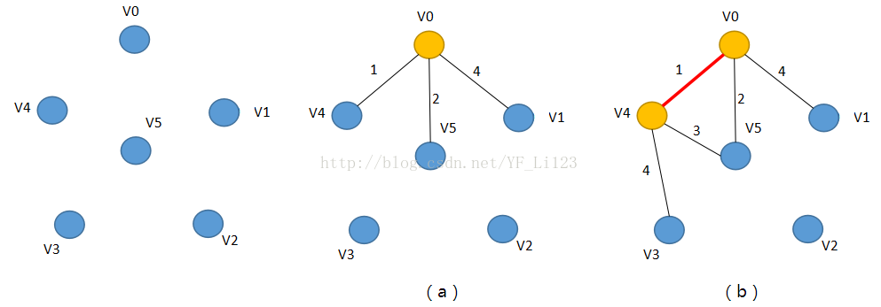
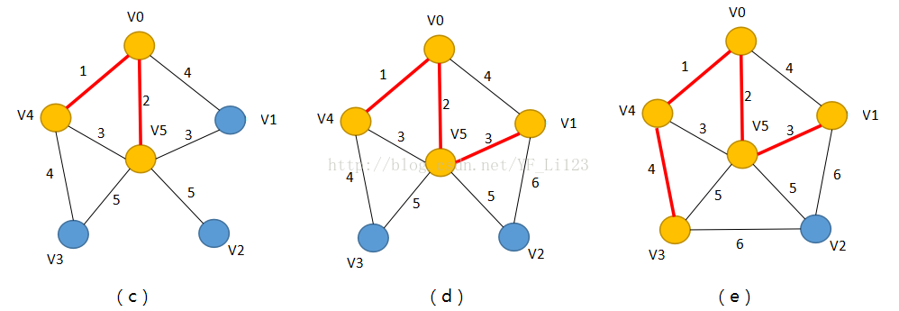
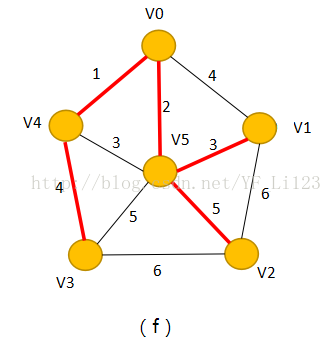

## 题目：[53. 寻宝](https://kamacoder.com/problem.php?id=1053)
在世界的某个区域，有一些分散的神秘岛屿，每个岛屿上都有一种珍稀的资源或者宝藏。你是一名探险者，决定前往这些岛屿，但为了节省时间和资源，你希望规划一条最短的路径，以便在探索这些岛屿时尽量减少旅行的距离。 

给定一张地图，其中包括了所有的岛屿，以及它们之间的距离。每个岛屿都需要被至少访问一次，你的目标是规划一条最短路径，以最小化探索路径的总距离，同时确保访问了所有岛屿。
## 输入：
第一行包含两个整数V 和 E，V代表顶点数，E代表边数 

接下来共有 E 行，每行三个整数 v1，v2 和 val，v1 和 v2 为边的起点和终点，val代表边的权值。
## 输出：
输出联通所有岛屿的最小路径总距离

## 样例输入
```
7 11
1 2 1
1 3 1
1 5 2
2 6 1
2 4 2
2 3 2
3 4 1
4 5 1
5 6 2
5 7 1
6 7 1
```

## 思路：
[Prim's算法](https://blog.csdn.net/YF_Li123/article/details/75148998)(下面的代码学习自卡码网答案解析，而非本链接)




## 代码
- 学习自：[答案解析](https://github.com/youngyangyang04/kamacoder-solutions/blob/main/problems/0053.%E5%AF%BB%E5%AE%9D.md)
```
#include <iostream>
#include <climits>
#include <vector>
using namespace std;

int main(){
    int V = 0, E = 0;
    while(cin >> V >> E){
        //构造图
        vector<vector<int>> grid(V, vector<int>(V, INT_MAX));
        for(int i = 0; i < E; i++){
            int v1,v2,val;
            cin >> v1 >> v2 >> val;
            //无向图，所以矩阵需要同时初始化两个方向
            grid[v1-1][v2-1] = val;
            grid[v2-1][v1-1] = val;
        }
        
        //minDis[i]用于记录到达i这个顶点的最小距离（出发点目前未知）。
        vector<int> minDis(V, INT_MAX);
        //isInTree[i]用于记录顶点i是否已经在最小生成树里了
        vector<bool> isInTree(V, false);    
        
        minDis[0] = 0;  //第一个顶点到达自身的距离是0。
        //要找到E条边的最小生成树
        for(int i = 0; i < V - 1; i++){
            int curSrcVetx = -1; //curSrcVetx表示这一次循环中用的出发点
            
            for(int j = 0; j < V; j++){
                //如果一个顶点并不在最小生成树中，且到这个顶点的距离是目前所有距离中最小的一个
                //那么他就是这一次要选择的出发点
                if(!isInTree[j] && (curSrcVetx == -1 || minDis[j] < minDis[curSrcVetx])){
                    curSrcVetx = j; //找到这一次循环中的出发点
                }
            }
            
            isInTree[curSrcVetx] = true;
            
            //新加入了一个顶点到最小生成树后，根据他所连接的点更新minDis:
            // 更新目前找到的这个节点到其他节点的最小值
            // 注意这里也需要其他节点是未被加入最小生成树的
            for(int k = 0; k < V; k++){
                if(!isInTree[k] && grid[curSrcVetx][k] < minDis[k]){
                    minDis[k] = grid[curSrcVetx][k];
                }
            }
        }
        
        // 得到路径和
        int sum = 0;
        for(int num : minDis)
            sum += num;
        cout << sum << endl;
    }
    return 0;
}
```