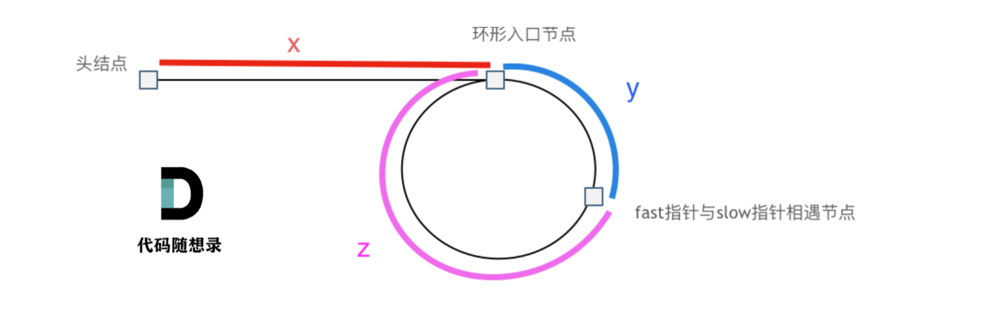

# [24. 两两交换链表中的节点](https://leetcode.cn/problems/swap-nodes-in-pairs/)
### 思路：

1. 创建一个dummyHead并指向head，一个cur指向dummyHead
2. 保存==节点3与节点2==到临时指针
3. 按照步骤，先把cur的next(->next)指向节点2，然后把节点2的next(cur->next->next)指向节点1，再把节点1的next(cur->next->next->next)指向节点3。
### 难点： 如何处理指针
   
[------------>代码随想录题目详解戳这里](https://programmercarl.com/0024.%E4%B8%A4%E4%B8%A4%E4%BA%A4%E6%8D%A2%E9%93%BE%E8%A1%A8%E4%B8%AD%E7%9A%84%E8%8A%82%E7%82%B9.html)

### 代码：  
```
/**
 * Definition for singly-linked list.
 * struct ListNode {
 *     int val;
 *     ListNode *next;
 *     ListNode() : val(0), next(nullptr) {}
 *     ListNode(int x) : val(x), next(nullptr) {}
 *     ListNode(int x, ListNode *next) : val(x), next(next) {}
 * };
 */
class Solution {
public:
    ListNode* swapPairs(ListNode* head) {
        ListNode* dummyHead = new ListNode(0);//创建虚拟头节点
        dummyHead->next = head;
        ListNode* cur = dummyHead;

        while(cur->next != nullptr && cur->next->next != nullptr){
            ListNode* temp1 = cur->next; //保存头部节点
            ListNode* temp2 = cur->next->next->next;//保存第二个节点

            cur->next = cur->next->next;
            cur->next->next = temp1;
            cur->next->next->next = temp2;

            cur = cur->next->next;
        }
        return dummyHead->next;
    }
};
```

# [19. 删除链表的倒数第 N 个结点（双指针）](https://leetcode.cn/problems/remove-nth-node-from-end-of-list/)
### 思路：
双指针思想：
1. 定义fast slow两个指针指向dummyHead。（假设有dummyHead，没有就定义一个dummyHead）
2. 假设要删除倒数第N个节点，fast指针先走n+1个节点（所以fast永远领先slow n+1个节点，当fast为null的时候，倒数第1个节点就是链表的末尾节点，slow是fast(null)的倒数第（n+1)个节点，也就是链表的倒数第(n+1)个节点，我们可以操作slow->next来删除节点。
### 难点：
- 结尾处不能返回head，因为head有可能已经被删除了
   
[------------>代码随想录题目详解戳这里](https://programmercarl.com/0019.%E5%88%A0%E9%99%A4%E9%93%BE%E8%A1%A8%E7%9A%84%E5%80%92%E6%95%B0%E7%AC%ACN%E4%B8%AA%E8%8A%82%E7%82%B9.html)

### 代码：  
```
/**
 * Definition for singly-linked list.
 * struct ListNode {
 *     int val;
 *     ListNode *next;
 *     ListNode() : val(0), next(nullptr) {}
 *     ListNode(int x) : val(x), next(nullptr) {}
 *     ListNode(int x, ListNode *next) : val(x), next(next) {}
 * };
 */
class Solution {
public:
    ListNode* removeNthFromEnd(ListNode* head, int n) {
        ListNode* dummyHead = new ListNode(0);
        dummyHead->next = head;
        ListNode* fast = dummyHead, *slow = dummyHead;

        //fast指针先走，领先slow指针n+1个位置
        for(int i = 0; i < n+1; i++)
            fast = fast->next;
        
        //fast slow同时走，直到fast到达链表末尾的下一个节点，此时slow到达第倒数第n+1个节点
        while(fast != NULL){
            fast = fast->next;
            slow = slow->next;
        }
        
        ListNode* temp = slow->next;//保存slow->next以便断开后删除
        slow->next = slow->next->next;//断开slow->next节点
        //删除原来的slow->next
        temp->next = NULL;
        delete temp;

        return dummyHead->next;//此处不能返回head因为head有可能被删除了
    }
};
```

# [面试题 02.07. 链表相交](https://leetcode.cn/problems/intersection-of-two-linked-lists-lcci/)
### 思路：
1. 找到两个链表的size并求出size差
2. 将长链表先移动，使两个链表处于同一起跑线
3. 比较两个链表的节点，如果相等就返回，如果不等就同时向下走，直到到null为止

### 难点：
- 如何要确定并先移动长链表
   
[------------>代码随想录题目详解戳这里](https://programmercarl.com/%E9%9D%A2%E8%AF%95%E9%A2%9802.07.%E9%93%BE%E8%A1%A8%E7%9B%B8%E4%BA%A4.html)

### 代码： 
```
/**
 * Definition for singly-linked list.
 * struct ListNode {
 *     int val;
 *     ListNode *next;
 *     ListNode(int x) : val(x), next(NULL) {}
 * };
 */
class Solution {
public:
    ListNode *getIntersectionNode(ListNode *headA, ListNode *headB) {
        int sizeA = 0, sizeB = 0;
        ListNode *temp = headA;
        //找A链表的长度
        while(temp){
            sizeA++;
            temp = temp->next;
        }
        //找B链表的长度
        temp = headB;
        while(temp){
            sizeB++;
            temp = temp->next;
        }
        //比较链表长度，并把长链表作为第一个参数，短链表做第二个参数
        temp = nullptr;
        if(sizeA >= sizeB)
            temp = traverse(headA, headB, sizeA-sizeB);
        else
            temp = traverse(headB,headA, sizeB-sizeA);
        
        return temp;
    }

    //该函数会先移动长链表，使两个链表处于同一起跑线，然后开始比较，如果节点相同，则返回第一个相交节点，否则同时移动两个指针，直到找到为止。若不存在交点，返回nullptr。
    ListNode *traverse(ListNode *headX, ListNode *headY, int n){
        ListNode* tempX = headX;
        ListNode* tempY = headY;
        for(int i = 0; i < n; i++)//首先移动长链表的指针使两链表处于同一起跑线
            tempX = tempX->next;
        while(tempX != tempY && tempX != nullptr && tempY != nullptr){//若两个节点不相同，则同时后移两个指针
            tempX = tempX->next;
            tempY = tempY->next;
        }
        //若两个链表没有交点，返回空指针
        if(tempX == NULL && tempY == NULL)
            return nullptr;
        return tempX;//否则返回交点
    }
};
```

# [142. 环形链表 II](https://leetcode.cn/problems/linked-list-cycle-ii/)
### 思路：

1. 双指针思想：
   - 定义fast slow两个指针。快指针每次移动两个节点，慢指针每次移动一个节点。**先找fast与slow的相遇点。然后从fast与slow的相遇点出发一个指针temp1，从head出发一个指针temp2，temp1与temp2相遇的点就是环形点入口**。
   - 原理：
     - 在相遇时，fast指针走的路程是(x+y+n*(y+z)),slow是(x+y)。由于快指针每次移动两个节点，所以slow的距离要乘2。
      2*(x+y) = x+y+n*(y+z)   
      => 2*(x+y) = x+y+n*(y+z)  
      => x+y = n*(y+z) 
      => x = -y + (n-1)(y+z) + y + z
      => x = z + (n-1)(y+z)
     - 当n=1，x = z，所以从“fast与slow的相遇节点”和“head”同时出发一个指针，两指针相遇的地方就是环形入口节点。当n>1时，该结论仍然正确，因为(y+z)刚好是一圈，所以z的起点仍然是fast与slow的相遇点。
  2. 用set。每经过一个节点就把它存入set，并从已有的set里寻找是否存在。第一次发现重复节点存在的时候说明此处是环形入口。

### 难点：
- 怎么找到fast与slow的相遇点（fast与slow一定相遇，且相遇点一定在环形内部）
- 如何找到环形入口。
   
[------------>代码随想录题目详解戳这里](https://programmercarl.com/0142.%E7%8E%AF%E5%BD%A2%E9%93%BE%E8%A1%A8II.html)

### 代码（双指针法）： 
```
/**
 * Definition for singly-linked list.
 * struct ListNode {
 *     int val;
 *     ListNode *next;
 *     ListNode(int x) : val(x), next(NULL) {}
 * };
 */
class Solution {
public:
    ListNode *detectCycle(ListNode *head) {
        ListNode *fast = head, *slow = head;
        while(fast != nullptr && fast->next != nullptr){//循环里面有fast->next->next，所以需要保证fast->next不为nullptr
            slow = slow->next;
            fast = fast->next->next;
            if(fast == slow){//当fast与slow在圆环内相遇时，从相遇点与head同时出发一个指针
                ListNode *temp1 = head;
                ListNode *temp2 = fast;
                while(temp1 != temp2){//当这两个指针相遇时，就是圆环入口
                    temp1 = temp1->next;
                    temp2 = temp2->next;
                }
                return temp1;
            }
        }
        return nullptr;
    }
};
```

### 代码(set)：
```
/**
 * Definition for singly-linked list.
 * struct ListNode {
 *     int val;
 *     ListNode *next;
 *     ListNode(int x) : val(x), next(NULL) {}
 * };
 */
class Solution {
public:
    ListNode *detectCycle(ListNode *head) {
        unordered_set<ListNode*> mySet;
        ListNode* tmp = head;
        
        while(tmp != NULL)
        {
            if(mySet.find(tmp) != mySet.end())
                return tmp;
            else
                mySet.insert(tmp);
            tmp = tmp->next;
        }
        return NULL;
    }
};
```