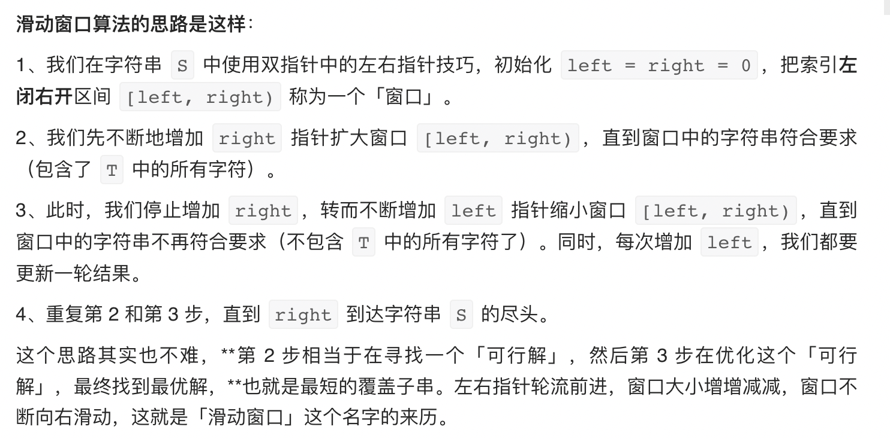

# 题型总结
## 一、数组的话求和求长度，主要有三种题型，
1. 如果数组都是正数的话，首选滑动窗口（连续子数组常用）/ 双指针（不连续的常用）
2. 如果有负数，选前缀和 + HashMap（有的也可以用滑动窗口）
3. 动态规划 较为复杂的


### 第一类题有 
#### 滑动窗口（求连续）
1. 长度最小的子数组
2. 乘积小于 K 的子数组
3. 删除子数组的最大得分
4. 可获得的最大点数

#### 可以不连续的，双指针
167. 两数之和 II - 输入有序数组
15. 三数之和

### 第二类题有，用hash表查找下标计算长度（map.put(0,-1))或者查找前缀和计算个数 (map.put(0,1))
按顺序做
1. 两数之和 模板题求下标
325. 和等于 k 的最长子数组长度 模板题求长度
560. 和为 K 的子数组 模板题求个数
525. 连续数组 处理0,1 (转化为325)
930. 和相同的二元子数组 处理0,1 (转化为560)，也可用滑窗
724. 寻找数组的中心下标 处理sum
974. 和可被 K 整除的子数组 处理负数
1248. 统计「优美子数组」 处理奇数 (转化为930)
523. 连续的子数组和 处理倍数
454. 四数相加 II 多个数组，分组处理
1052. 爱生气的书店老板 需预处理，条件是定值
1208. 尽可能使字符串相等 最值问题，条件是范围
1004. 最大连续1的个数 III 最值问题，条件是范围
1493. 删掉一个元素以后全为 1 的最长子数组 同1004

### 第三类题 动态规划
152. 乘积最大子数组
1186. 删除一次得到子数组最大和
1191. K 次串联后最大子数组之和

### 字符串通常也是滑动窗口+hash，或者数组的其他求解题型（排序，重复等等）
3. 无重复字符的最长子串
76. 最小覆盖子串
438. 找到字符串中所有字母异位词
567. 字符串的排列
581. 最短无序连续子数组
643. 子数组最大平均数 I
718. 最长重复子数组

作者：xiao-hou-hou-ai-chi-tao
链接：https://leetcode.cn/problems/maximum-size-subarray-sum-equals-k/solution/lian-xu-zishu-by-xiao-hou-hou-ai-chi-tao-g9ln/
来源：力扣（LeetCode）
著作权归作者所有。商业转载请联系作者获得授权，非商业转载请注明出处。


## 二、滑动窗口模板
### 模板一
```
/* 滑动窗口算法框架 */
void slidingWindow(string s, string t) {
    unordered_map<char, int> need, window;
    for (char c : t) need[c]++;
    
    int left = 0, right = 0;
    int valid = 0; 
    while (right < s.size()) {
        // c 是将移入窗口的字符
        char c = s[right];
        // 右移窗口
        right++;
        // 进行窗口内数据的一系列更新
        ...

        /*** debug 输出的位置 ***/
        printf("window: [%d, %d)\n", left, right);
        /********************/
        
        // 判断左侧窗口是否要收缩
        while (window needs shrink) {
            // d 是将移出窗口的字符
            char d = s[left];
            // 左移窗口
            left++;
            // 进行窗口内数据的一系列更新
            ...
        }
    }
}

作者：labuladong
链接：https://leetcode.cn/problems/find-all-anagrams-in-a-string/solution/hua-dong-chuang-kou-tong-yong-si-xiang-jie-jue-zi-/
来源：力扣（LeetCode）
著作权归作者所有。商业转载请联系作者获得授权，非商业转载请注明出处。
```


### 模板二
```
def findSubArray(nums):
    N = len(nums) # 数组/字符串长度
    left, right = 0, 0 # 双指针，表示当前遍历的区间[left, right]，闭区间
    sums = 0 # 用于统计 子数组/子区间 是否有效，根据题目可能会改成求和/计数
    res = 0 # 保存最大的满足题目要求的 子数组/子串 长度
    while right < N: # 当右边的指针没有搜索到 数组/字符串 的结尾
        sums += nums[right] # 增加当前右边指针的数字/字符的求和/计数
        while 区间[left, right]不符合题意: # 此时需要一直移动左指针，直至找到一个符合题意的区间
            sums -= nums[left] # 移动左指针前需要从counter中减少left位置字符的求和/计数
            left += 1 # 真正的移动左指针，注意不能跟上面一行代码写反
        # 到 while 结束时，我们找到了一个符合题意要求的 子数组/子串
        res = max(res, right - left + 1) # 需要更新结果
        right += 1 # 移动右指针，去探索新的区间
    return res

```
滑动窗口中用到了左右两个指针，它们移动的思路是：以右指针作为驱动，拖着左指针向前走。右指针每次只移动一步，而左指针在内部 while 循环中每次可能移动多步。右指针是主动前移，探索未知的新区域；左指针是被迫移动，负责寻找满足题意的区间。

作者：fuxuemingzhu
链接：https://leetcode.cn/problems/max-consecutive-ones-iii/solution/fen-xiang-hua-dong-chuang-kou-mo-ban-mia-f76z/
来源：力扣（LeetCode）
著作权归作者所有。商业转载请联系作者获得授权，非商业转载请注明出处。