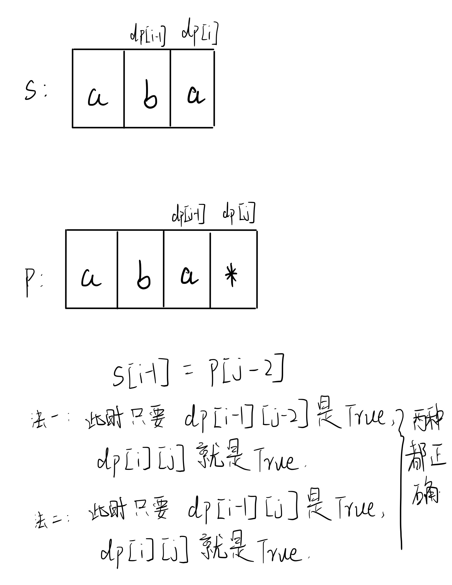
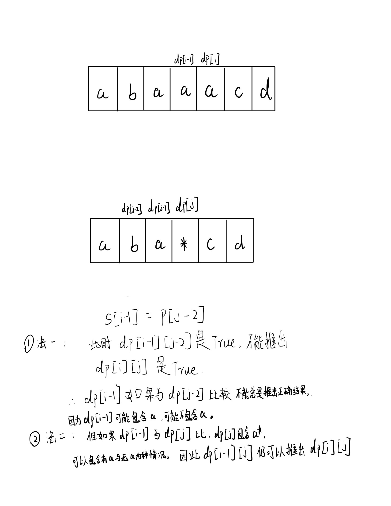

# [10. 正则表达式匹配](https://leetcode.cn/problems/regular-expression-matching/)
### 题目：
给你一个字符串 s 和一个字符规律 p，请你来实现一个支持 '.' 和 '*' 的正则表达式匹配。

'.' 匹配任意单个字符
'*' 匹配零个或多个前面的那一个元素
所谓匹配，是要涵盖 整个 字符串 s的，而不是部分字符串。

 
示例 1：
```
输入：s = "aa", p = "a"
输出：false
解释："a" 无法匹配 "aa" 整个字符串。
```
示例 2:
```
输入：s = "aa", p = "a*"
输出：true
解释：因为 '*' 代表可以匹配零个或多个前面的那一个元素, 在这里前面的元素就是 'a'。因此，字符串 "aa" 可被视为 'a' 重复了一次。
```
示例 3：
```
输入：s = "ab", p = ".*"
输出：true
解释：".*" 表示可匹配零个或多个（'*'）任意字符（'.'）。
```

提示：
```
1 <= s.length <= 20
1 <= p.length <= 30
s 只包含从 a-z 的小写字母。
p 只包含从 a-z 的小写字母，以及字符 . 和 *。
保证每次出现字符 * 时，前面都匹配到有效的字符
```
### 思路：
- 要return true，p里的每一个字符都需要用到且可以匹配完所有的s里的字符
1. dp[ i ][ j ]表示s的前 i 个（index i - 1）与p的前 j 个（index j - 1）能否匹配。
2. base case：
   1. base case 1: dp[ i ][ 0 ]，i > 0,一定全为false，即用空集p来匹配非空集s。
   2. base case 2: dp[ 0][ j ], j > 0, 此时如果p[j - 1] = ' * '，那么dp[ 0 ][ j ] = dp[ 0 ][j - 2]。（例子：s = "", p = ‘a*’, p可以是0个a，也就是空集) 
   3. dp[ 0 ][ 0 ] = true
3. 递推公式：三种情况
   1. 情况一：最简单的情况，s[i - 1] = p[j - 1]，那么只要s的前 i - 1个字符串与p的前j - 1个字符串匹配（dp[i - 1][j - 1]是true），当前情况就一定匹配，dp[ i ][ j ] = dp[i - 1][j - 1];
   2. 情况二：如果s[i - 1] != p[j - 1]，但是p[j - 1] = '.'。那么也相当于s[i - 1] = p[j - 1]，所以可以与情况一合并。dp[ i ][ j ] = dp[i - 1][j - 1];
   3. 情况三：如果s[i - 1] != p[j - 1]，但是p[j - 1] = ' * '。那么我们就要判断s的当前位置s[i - 1]与p的当前位置的前一位p[j - 2]是否相等（p 的当前位置是 * 号，它的值是依据他的前一位的值）。此时有两种情况：
      1. 情况一：s的当前位置s[i - 1]与p的当前位置的前一位p[j - 2]不相等，即s[i - 1] != p[j - 2]，那么我们就不能用 *号匹配。最终匹配零个前面的元素。此时dp[ i ][ j ]=dp[ i ][j - 2]，表示 s 的前 i 个字符和 p 的前j - 2个字符是否是匹配的。 （例子："a" 与 "ab * "结果是true；"c" 与 "ab *"结果是false；"b" 与 "ab *"结果是false）
      2. 情况二：s的当前位置s[i - 1]与p的当前位置的前一位p[j - 2]相等，即s[i - 1] == p[j - 2]，**或者p[j - 2]是'.'（这个非常容易漏）**。此时如果 s 的前i - 1个字符和 p 的前 j 个字符是匹配的，即dp[i - 1][ j ] = True，那么当前情况也是true。
         - ==为什么是 s 的前i - 1个字符和 p 的前 j 个字符呢？==
         - 因为 p 的前 j 个字符里，最后两个一定是'某特定char' + ' * '，他们对应在s里的数量可以是0～k。dp[i - 1][ j ]表示用s[0 : i - 2] 与 p[0 : j - 1]比较，具体来看就是用s[0 : i - 2] 与 p[0 : j - 3] + '0个某特定char'/ '1个某特定char'/.../'k个某特定char'比较。此时不论s[0 : i - 2]里是否有重复的“某特定char”，情况都能够被覆盖。例子看下图：
        
        ===================================
        

### 难点：
- 在p[j - 1] = * 时，分的两种情况。
- 情况二：s的当前位置s[i - 1]与p的当前位置的前一位p[j - 2]相等，即s[i - 1] == p[j - 2]，**或者p[j - 2]是'.'（这个非常容易漏）**。此时如果 s 的前i - 1个字符和 p 的前 j 个字符是匹配的，即dp[i - 1][ j ] = True，那么当前情况也是true。==为什么是 s 的前i - 1个字符和 p 的前 j 个字符呢？==

### 代码：  
```
class Solution {
public:
    bool isMatch(string s, string p) {
        vector<vector<bool>> dp(s.size()+1, vector<bool>(p.size()+1, false));
        dp[0][0] = true;
        //base case 1: dp[i][0]，i > 0,一定全为false，即用空集p来匹配非空集s
        //base case 2: dp[0][j], j > 0, 此时如果p[j - 1] = ‘*’，那么dp[0][j] = dp[0][j - 2]。（例子：s = "", p = "a*", p可以是0个a，也就是空集) 
        for(int j = 2; j <= p.size(); j++){
            if(p[j-1] == '*')//*一定出现在index 1或者 1以后，所以j可以从2开始遍历
                dp[0][j] = dp[0][j-2];  // 
        }

        for(int i = 1; i <= s.size(); i++){
            for(int j = 1; j <= p.size(); j++){
                if(s[i-1] == p[j-1])    //情况一
                    dp[i][j] = dp[i-1][j-1];
                else if(s[i-1] != p[j-1] && p[j-1] == '.')  //情况二
                    dp[i][j] = dp[i-1][j-1];
                else if(p[j-1] == '*'){ //情况三
                    dp[i][j] = dp[i][j-2] || (dp[i-1][j] && (s[i-1] == p[j-2] || p[j-2] == '.'));
                }
            }
        }
        return dp[s.size()][p.size()];
    }
};
```