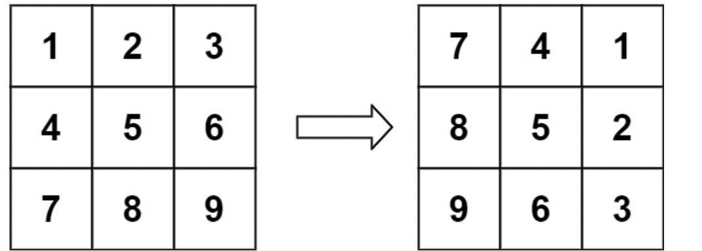
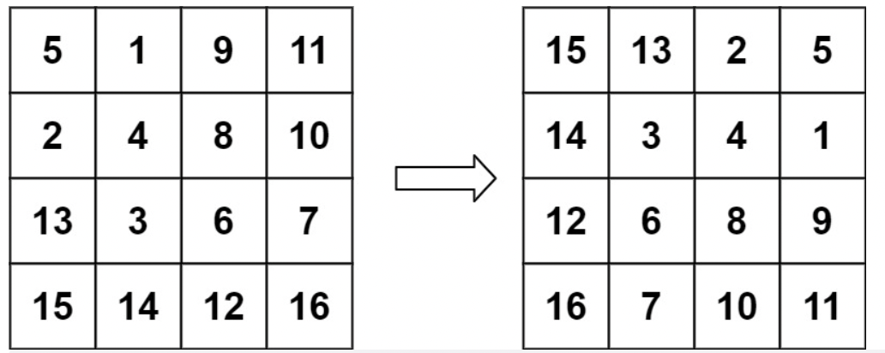
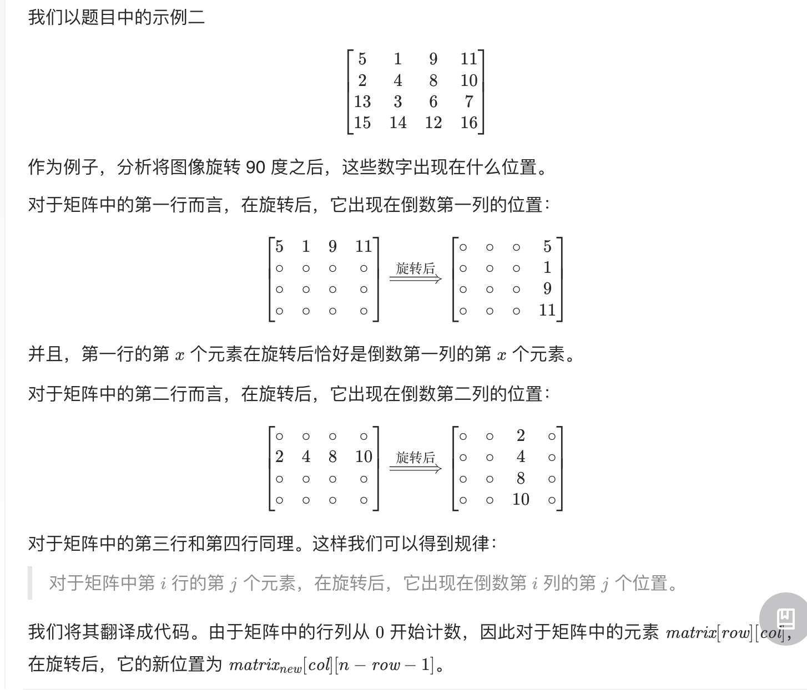

# [48. 旋转图像](https://leetcode.cn/problems/rotate-image/)
### 题目：
给定一个 n × n 的二维矩阵 matrix 表示一个图像。请你将图像顺时针旋转 90 度。

你必须在 原地 旋转图像，这意味着你需要直接修改输入的二维矩阵。请不要 使用另一个矩阵来旋转图像。

示例 1：

```
输入：matrix = [[1,2,3],[4,5,6],[7,8,9]]
输出：[[7,4,1],[8,5,2],[9,6,3]]
```
示例 2：

```
输入：matrix = [[5,1,9,11],[2,4,8,10],[13,3,6,7],[15,14,12,16]]
输出：[[15,13,2,5],[14,3,4,1],[12,6,8,9],[16,7,10,11]]
```
  
提示：
```
n == matrix.length == matrix[i].length
1 <= n <= 20
-1000 <= matrix[i][j] <= 1000
```

来源：力扣（LeetCode）
链接：https://leetcode.cn/problems/rotate-image
著作权归领扣网络所有。商业转载请联系官方授权，非商业转载请注明出处。

### 思路：
- 将数组旋转后，第一行的数组变成最后一列，第二行的数组变成倒数第二列，第三行的数组变成倒数第三列。。。以此类推。
- 因此，第x行的第y个数字在旋转后会变成第y行的第(n-x-1)个数字（x从0开始算）。
- 以下为leetcode题解：


[------------>题目详解戳这里](https://leetcode.cn/problems/rotate-image/solution/xuan-zhuan-tu-xiang-by-leetcode-solution-vu3m/)
### 难点：


### 代码：  
```
class Solution {
public:
    void rotate(vector<vector<int>>& matrix) {
        auto newMatrix = matrix;
        int n = matrix.size();

        for(int i = 0; i < n; i++){
            for(int j = 0; j < n; j++)
                newMatrix[j][n-i-1] = matrix[i][j];
        }
        matrix = newMatrix;
    }
};
```
