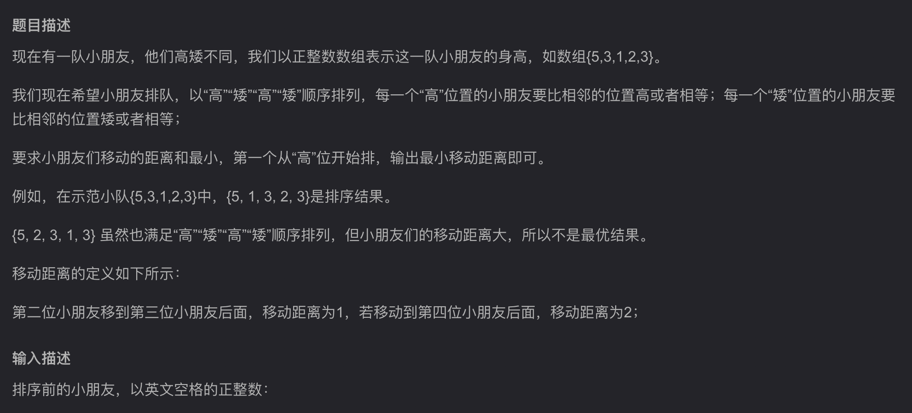

# 题目

# 题解
```
#include <iostream>
#include <sstream>
#include <vector>
using namespace std;

int main() {
    string s;
    vector<int> heights;
    getline(cin, s);    //取得当前这一行数据，保存到s中
    if (s.find_first_not_of("0123456789 ") != string::npos) {//如果s中找到了0-9或者空格以外的字符，那么直接输出[]
        cout << "[]" << endl;
        return 0;
    }

    istringstream buf(s);   //用缓存istringstream保存字符串s，方便直接转换成int
    int cur;
    while (buf >> cur) {//istringstream会把缓存中的字符以空格为界限输入并转换成int
        heights.push_back(cur);
    }

    int i = 0, j = 1;
    while (j < heights.size()) {
        if (heights[i] != heights[j]) {
            //如果i为偶数，j为奇数，那么(i,j)应该是(高，矮)，那么heights[i] < heights[j]的情况就需要交换
            if(heights[i] < heights[j] && i % 2 == 0){
                int tmp = heights[i];
                heights[i] = heights[j];
                heights[j] = tmp;
            }
            else if(heights[i] > heights[j] && i % 2 != 0){
                ////如果i为奇数，j为偶数，那么(i,j)应该是(矮，高)，那么heights[i] > heights[j]的情况就需要交换
                int tmp = heights[i];
                heights[i] = heights[j];
                heights[j] = tmp;
            }
        }
        i++;
        j++;
    }

    for(int num : heights){
        cout << num << " " ;
    }
    cout << endl;

    return 0;
}
```

